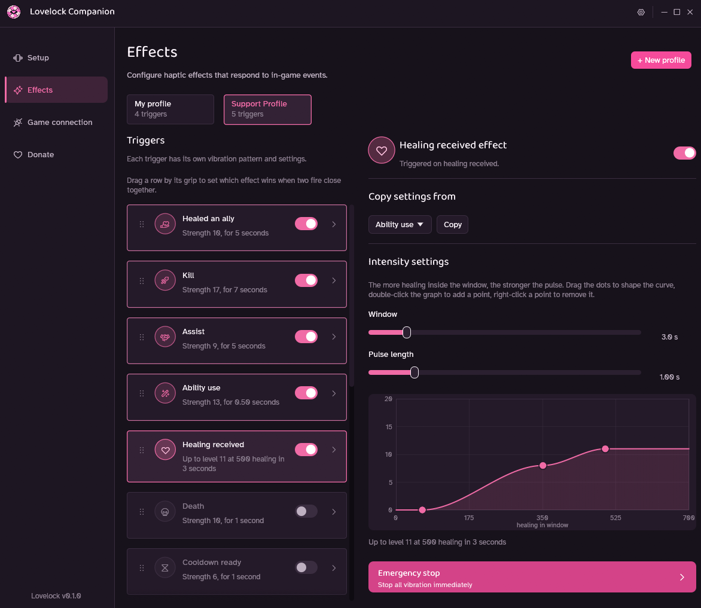

# Lovelock Companion

Lovelock Companion is a desktop app that syncs local-player deaths, kills, assists, ability uses, and cooldown readiness in Deadlock to a Lovense toy over the local Standard API.

## !!! Required Deadlock mod !!!

Lovelock Companion does not work by itself. Install and enable the [DeadlockShock mod from GameBanana](https://gamebanana.com/mods/700758) in Deadlock before starting the companion. The mod detects gameplay events and writes them to the log that the companion listens to.

Huge shoutout to volc/bolc for creating the original DeadlockShock mod that Lovelock Companion is built on.

## Contents

- `companion/` is Lovelock Companion, the Lovense-only desktop app.
- `lovense/` is the crate Lovelock Companion uses to talk to Lovense toys over
  the local Standard API ("Game Mode"), via the Lovense Connect/Remote app
  running on the same LAN. In **Setup**, enable Game Mode in the Lovense
  Remote app on the same PC, then Test connection. Connection settings, toy
  selection, and per-trigger vibration settings are all persisted.

The DeadlockShock mod that feeds Lovelock Companion its game events is built
and published separately; its source isn't part of this repo.

## Preview

[](./media/showcase.png)

## Building from source

You will need [Rust](https://rust-lang.org/). Install and enable the DeadlockShock mod (see above), then build and run Lovelock Companion from the repo root:

```sh
cargo run --manifest-path companion/Cargo.toml --release
```

On Windows, `build_and_run.bat` builds Lovelock Companion in debug mode and launches it in one step, which is handy while iterating.

In **Setup**, enter the Lovense Connect/Remote domain and HTTP port, test the connection, and optionally pick a specific toy (leave unselected to vibrate every connected toy).

In **Effects**, configure Death, Kill, Assist, Ability use, and Cooldown ready independently. Each trigger has its own vibration profile (fixed strength/duration, or a random interval). Ability-use and cooldown-ready also have independent positional-slot filters that apply across heroes; ability names appear when the addon reports them, with numbered slots as the fallback. Use the explicit Copy control to copy only the active vibration profile between triggers without changing enablement or ability selection. Local-player death is enabled by default, while Kill, Assist, and both ability triggers are opt-in. Cooldown ready covers both a normal cooldown finishing and a charged ability restoring a charge. Kill and Assist are read from the local player's own scoreboard KDA counters, so they fire once per credited kill or assist regardless of who lands the killing blow on a shared-credit takedown.

In **Game connection**, Lovelock Companion automatically resumes a saved `console.log` path or auto-detects Deadlock and starts the listener at launch. Use **Auto-detect** and **Start/Restart listener** for diagnostics, retry, or a manual path override. Deadlock must run with `-condebug` so the log is written.
On Windows releases Lovelock Companion uses the GUI application subsystem, so launching it from Explorer does not open a command window. On Windows and Linux, open **Menu → Show logs** for selectable startup and live diagnostics. Logs are retained only in memory for the current run and are not written to a persistent log file.

Lovelock Companion remembers your setup, including the Lovense connection, all five vibration profiles, and ability filters, in your OS user config directory. Ability names are runtime diagnostics and are not saved.

## Provider/action architecture

`src/provider.rs` owns the Lovense connection snapshot, connected blocking client, toy targets, test action, execution, and disconnect. `src/action.rs` owns vibration settings, validation, immutable resolution, and safe summaries; `src/action_ui.rs` contains the explicit egui editor. `src/theme.rs` holds Lovelock Companion's visual identity: a pastel bubblegum-pink accent on a dusty-plum dark theme, paired with the Baloo 2 display font and Atkinson Hyperlegible body font. Event acceptance resolves an action before a bounded worker queue, so later UI edits cannot change queued work and provider calls never run on the egui thread.

Saved state is strict schema 7 JSON; anything else (including old multi-provider saves) resets to defaults and the old file is preserved alongside it as a backup rather than migrated, since Lovelock Companion is a from-scratch Lovense-only companion.

## Publishing a release

1. Choose the release version and update `companion/Cargo.toml`.
2. Run the companion tests.
3. Push the matching tag:

```sh
git tag v<version>
git push origin v<version>
```

Drone verifies `DRONE_TAG == v<companion Cargo version>` before building and publishing the companion artifacts. The DeadlockShock mod VPK is built and published to GameBanana separately; Lovelock Companion warns in-app when the connected mod's reported version is older than the companion expects, so keep the GameBanana listing reasonably current with the companion release.
